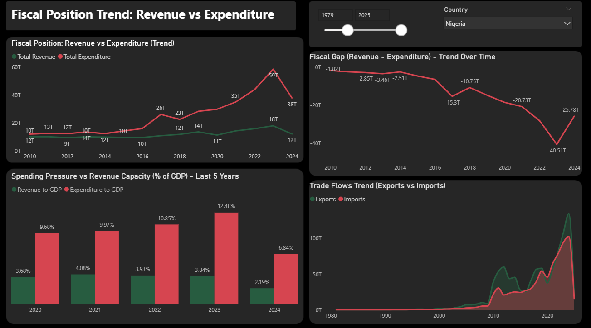

# Unraveling Africa’s Sovereign Debt Crisis

## Project Overview
This project analyzes sovereign debt dynamics across selected African countries, focusing on the interaction between debt burden, fiscal balance, inflation, interest rates, and macroeconomic stability.

The dashboard provides a comparative, data-driven view of fiscal sustainability risks and highlights structural pressures contributing to Africa’s sovereign debt challenges.

---

## Objective
- Assess debt sustainability across African economies using debt-to-GDP and fiscal balance indicators
- Analyze inflation, interest rates, and GDP growth trends over time
- Compare revenue capacity versus expenditure pressure
- Identify countries facing elevated fiscal and debt sustainability risks
- Support evidence-based fiscal and policy decision-making

---

## Tools Used
- Power BI
- Microsoft Excel

---

## Key Insights
- Several countries exhibit persistently high debt-to-GDP ratios, raising long-term sustainability concerns.
- Fiscal deficits remain structurally embedded, driven by expenditure growth outpacing revenue capacity.
- Inflation and policy interest rates show significant volatility, increasing debt servicing costs.
- Trade imbalances contribute to fiscal stress, particularly in import-dependent economies.
- Countries with weaker revenue-to-GDP ratios face greater exposure to debt distress.
- Risk categorization highlights varying degrees of fiscal vulnerability across the continent.

---

## Recommendations
- Strengthen domestic revenue mobilization to reduce reliance on debt financing.
- Implement expenditure rationalization strategies focused on efficiency and fiscal discipline.
- Pursue debt restructuring or reprofiling where debt servicing costs threaten fiscal stability.
- Coordinate monetary and fiscal policy to contain inflation and borrowing costs.
- Promote export diversification and trade balance improvements to enhance foreign exchange resilience.
- Use data-driven risk assessments to guide targeted fiscal reforms and policy prioritization.

---

## Files
- Unraveling_Africas_Sovereign_Debt_Crisis.pdf – Analytical dashboard report
- Unraveling_Africas_Sovereign_Debt_Crisis.pbix – Power BI source file

---

## Author
**Aduragbemi Oluwabunmi**  
Data Analyst | Power BI | Financial & Economic Analysis
