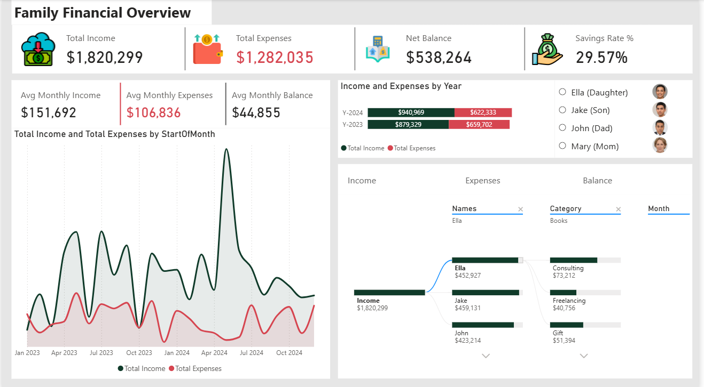

# Family & Personal Finance Expense Dashboard

## Project Overview
This project analyzes family and personal income, expenses, and savings patterns over time to provide clear financial visibility and support better budgeting and savings decisions.

The dashboard tracks income sources, spending categories, savings rate performance, and net balance trends across months and years.

---

## Objective
- Monitor total income, expenses, and net balance over time
- Track savings rate performance against a 30% target
- Identify high-spending categories and discretionary expenses
- Compare financial performance across years and household members
- Support data-driven budgeting and financial planning decisions

---

## Tools Used
- Power BI
- Microsoft Excel

---

## Key Insights
- Total income significantly exceeds total expenses, resulting in a positive overall net balance.
- The savings rate averages close to 30%, but fluctuates widely across months.
- Certain months record negative net balances, indicating periods of overspending.
- Expenses are heavily concentrated in a few key categories such as insurance, loan repayments, groceries, and subscriptions.
- Non-essential (want-based) expenses contribute meaningfully to total spending.
- Financial performance improves year-over-year, with stronger savings growth in the most recent year.

---

## Recommendations
- Introduce tighter spending controls during months with historically negative net balances.
- Set category-level spending limits for high-cost expense groups such as subscriptions and discretionary purchases.
- Maintain or increase the savings rate during high-income months to offset lower-performing periods.
- Regularly review expense categories to identify opportunities for cost optimization.
- Use savings-rate tracking as a monthly performance KPI to reinforce financial discipline.

---

## Files
- Family_Personal_Finance_Expense_Dashboard.pdf – Dashboard report
- Family_Personal_Finance_Expense_Dashboard.pbix – Power BI source file

---

## Author
**Aduragbemi Oluwabunmi**  
Data Analyst | Excel | Power BI
